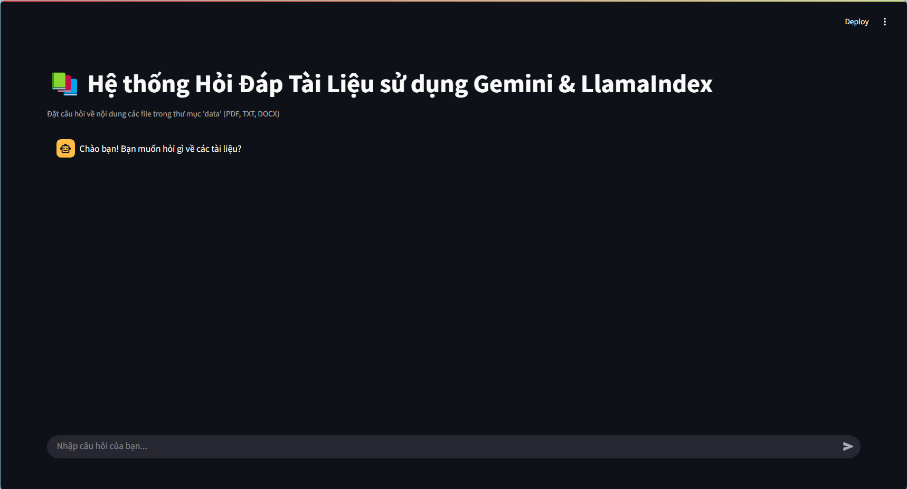
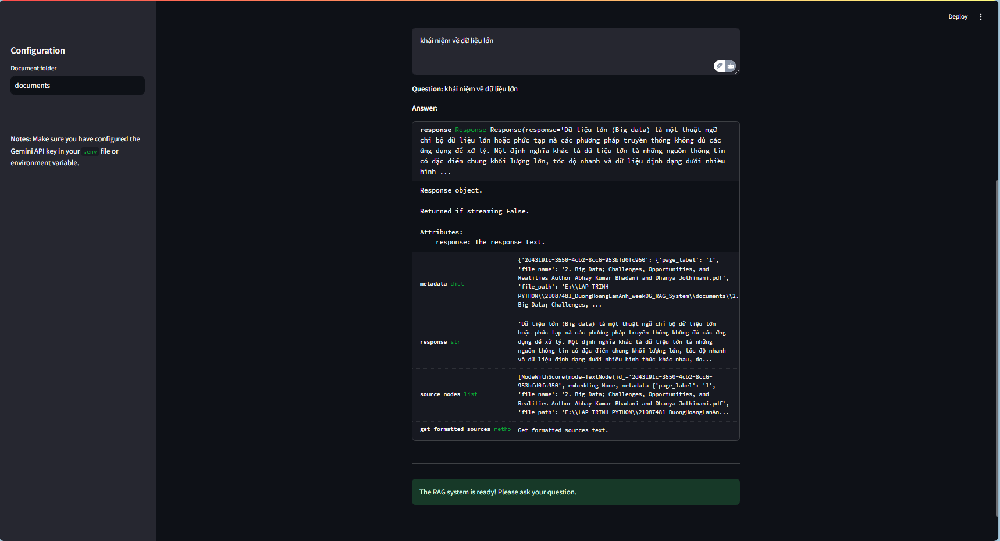

# RAG System using LlamaIndex and Gemini

## Submission Information

**Full Name:** Dương Hoàng Lan Anh
**Student ID:** 21087481
**Course:** Introduction to Big Data

---

## Introduction

The `w6_21087481_DuongHoangLanAnh.py` file includes the following main steps:

1.  **Import Libraries:** Imports necessary modules from LlamaIndex and other libraries.
2.  **Configure Gemini API Key:** Sets up the API key for using Gemini.
3.  **Load and Process Data:** Reads the document and splits it into nodes.
4.  **Configure LLM and Embedding:** Selects Gemini LLM and Embedding models.
5.  **Create Indexes:** Generates Vector Index and Summary Index.
6.  **Create Query Engines:** Creates SummaryQueryEngine and VectorQueryEngine.
7.  **Create Query Engine Tools:** Packages Query Engines into tools.
8.  **Create Router Query Engine:** Sets up RouterQueryEngine for coordination.
9.  **Use the RAG system:** Poses example questions and prints the answers.

---

## Results

Homepage

QA

